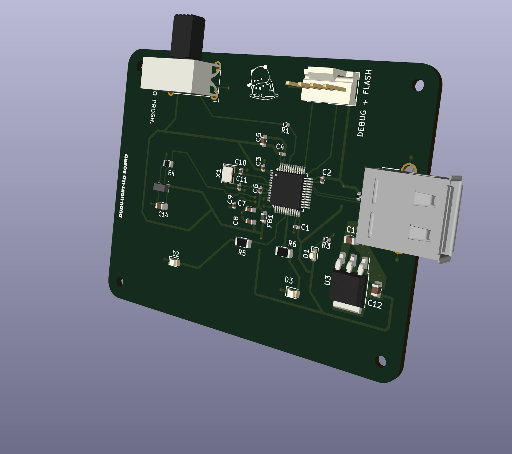

This PCB uses USB voltage to control a sensor that turns light on when its dark. It's made as a cute little gift for a loved one.
The switch and debug pins are used to transfer the code for the microprocessor which controls the sensor and turns on/off the light.
